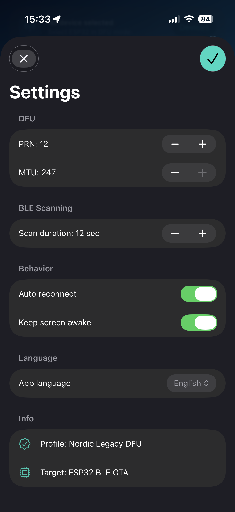

# ESP32-DFU iOS Client

[](LICENSE)
[](https://developer.apple.com/ios/)
[](https://github.com/Developer-RU/ESP32-BLE-OTA)

SwiftUI iPhone application for over-the-air firmware updates of ESP32 devices over BLE using the **Nordic Legacy DFU** profile. No proprietary SDK required — implemented directly on CoreBluetooth.

---

## Screenshots

<p align="center">
  
  &nbsp;
  
  &nbsp;
  
</p>

---

## Features

| Feature | Details |
|---------|---------|
| BLE Scan & Connect | Automatic scan for devices advertising the DFU service; tap to connect |
| File Picker | System document picker — select any `.bin` firmware file from Files app, iCloud Drive, or AirDrop |
| Init Packet | Sends 8-byte legacy DFU init packet (firmware size + CRC32) before data transfer |
| Chunked Transfer | Streams firmware in configurable packet chunks with receipt notification (PRN) flow control |
| Progress Tracking | Real-time byte counter, percentage bar, transfer rate, and ETA |
| Stage Timeline | Visual pipeline: Connect → Prepare → Transfer → Validate → Activate |
| Error Diagnostics | Maps all Nordic DFU error opcodes to human-readable descriptions |
| Cancel & Retry | Clean abort at any stage; automatic reconnect and retry on connection loss |
| Background Restoration | CoreBluetooth session state restored if app is suspended mid-transfer |
| Settings | Configurable PRN interval and transfer chunk size |
| Localization | English UI (localization architecture ready for extension) |

---

## Requirements

- **iOS 15.0+**
- **Xcode 15+**
- Physical iPhone (BLE not available on Simulator)
- [XcodeGen](https://github.com/yonaskolb/XcodeGen) — to generate the `.xcodeproj` from `project.yml`
- Target ESP32 device running [ESP32-BLE-OTA](https://github.com/Developer-RU/ESP32-BLE-OTA) firmware

---

## Getting Started

```bash
# Clone the repository
git clone https://github.com/Developer-RU/ESP32-DFU-iOS.git
cd ESP32-DFU-iOS

# Generate Xcode project
brew install xcodegen   # skip if already installed
xcodegen generate

# Open in Xcode
open ESP32DFU.xcodeproj
```

1. Select your physical iPhone as the run destination.
2. Set your **Team** in *Signing & Capabilities* (free Apple ID works for personal testing).
3. Press **Run** (`⌘R`).

---

## DFU Protocol

The app implements **Nordic Legacy DFU** — the same profile used in nRF5 Series devices, repurposed for ESP32.

### BLE Service & Characteristics

| Role | UUID |
|------|------|
| DFU Service | `00001530-1212-EFDE-1523-785FEABCD123` |
| DFU Control Point | `00001531-1212-EFDE-1523-785FEABCD123` |
| DFU Packet | `00001532-1212-EFDE-1523-785FEABCD123` |
| DFU Version | `00001534-1212-EFDE-1523-785FEABCD123` |

### Update Sequence

```
iOS                                        ESP32
 │                                           │
 │── Write 0x01 (Start DFU, type=4) ──────► │  Begin OTA session
 │◄─ Notify 0x10 0x01 0x01 (OK) ───────────│
 │                                           │
 │── Write Init Packet (8 bytes) ──────────► │  [size LE32] [crc32 LE32]
 │── Write 0x02 (Receive Init Packet) ─────► │
 │◄─ Notify 0x10 0x02 0x01 (OK) ───────────│
 │                                           │
 │── Write 0x08 PRN=N ─────────────────────► │  Set receipt notification interval
 │◄─ Notify 0x10 0x08 0x01 (OK) ───────────│
 │                                           │
 │── Write 0x03 (Receive Firmware Image) ──► │  Announce byte count
 │◄─ Notify 0x10 0x03 0x01 (OK) ───────────│
 │                                           │
 │── Write chunk #1 (Packet chr) ──────────► │
 │── Write chunk #2 ───────────────────────► │
 │   ...                                     │
 │── Write chunk #N ───────────────────────► │
 │◄─ Notify 0x11 [bytesReceived LE32] ──────│  Receipt notification
 │   (repeat for each PRN window)            │
 │                                           │
 │── Write 0x04 (Validate) ────────────────► │  CRC32 + size check
 │◄─ Notify 0x10 0x04 0x01 (OK) ───────────│
 │                                           │
 │── Write 0x05 (Activate & Reset) ────────► │  Flash commit, reboot to new firmware
```

### Error Codes

| Code | Meaning |
|------|---------|
| `0x02` | Invalid state |
| `0x03` | Not supported |
| `0x04` | Data size exceeds limit |
| `0x05` | CRC error |
| `0x06` | Operation failed |

---

## Project Structure

```
ESP32DFU/
├── App/
│   ├── ESP32DFUApp.swift          # App entry point, CoreBluetooth restoration delegate
│   └── AppDelegate.swift
├── BLE/
│   ├── DFUManager.swift           # Central manager, scan, connect, characteristic discovery
│   ├── DFUSession.swift           # Full DFU state machine (opcode send / notify receive)
│   └── DFUConstants.swift         # Service / characteristic UUIDs
├── Model/
│   ├── DFUState.swift             # Enum: idle, scanning, connecting, transferring, done, error
│   └── DFUError.swift             # Typed error with Nordic opcode mapping
├── UI/
│   ├── MainView.swift             # Root view — device list or DFU progress
│   ├── DeviceListView.swift       # Scan results table
│   ├── DFUProgressView.swift      # Stage timeline + progress bar
│   └── SettingsView.swift         # PRN interval, chunk size
├── Util/
│   └── CRC32.swift                # Pure Swift CRC32 (ISO 3309 polynomial)
├── Resources/
│   └── Localization.swift         # String constants
├── project.yml                    # XcodeGen project spec
└── Info.plist
```

---

## How to Build a Firmware Binary

On the firmware side, use [ESP32-BLE-OTA](https://github.com/Developer-RU/ESP32-BLE-OTA) with PlatformIO:

```bash
cd ESP32-BLE-OTA
pio run                        # builds firmware
# Output binary: .pio/build/esp32dev/firmware.bin
```

Transfer `firmware.bin` to your iPhone via AirDrop, iCloud Drive, or USB, then select it in the app's file picker.

---

## Troubleshooting

| Symptom | Likely Cause | Fix |
|---------|-------------|-----|
| No devices appear in scan | ESP32 not advertising / Bluetooth off | Power-cycle ESP32; enable Bluetooth on iPhone |
| Connect fails immediately | Another central already connected | Reset ESP32 to drop existing connection |
| Transfer stalls at 0% | Init packet rejected (size/CRC mismatch) | Rebuild firmware; ensure `.bin` is not truncated |
| Validate fails | Binary corrupted during transfer | Lower PRN interval in Settings; retry |
| App crashes on launch | Missing Bluetooth usage description in Info.plist | Add `NSBluetoothAlwaysUsageDescription` key |
| "Not supported" error | Device does not expose DFU service | Confirm ESP32 is running correct firmware |

---

## License

[MIT](LICENSE) © 2025 Developer-RU
